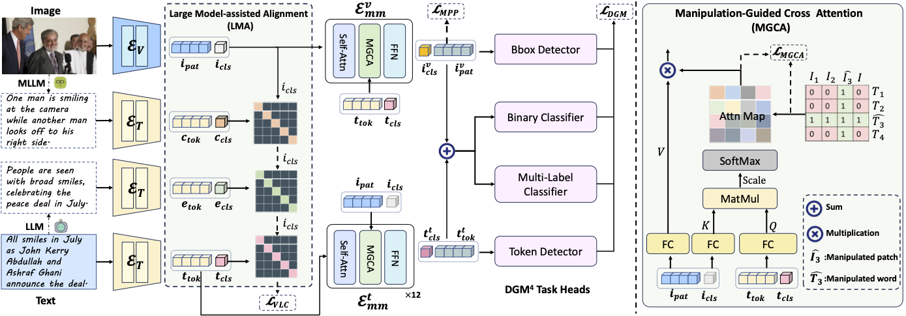

# ASAP: Advancing Semantic Alignment Promotes Multi-Modal Manipulation Detecting and Grounding  

This repository contains the official implementation of **ASAP**, proposed in our paper:    

We will release the code here soon. Stay tuned! 🚀  

---

## 📖 Paper Overview  

**ASAP** is a novel framework for **Detecting and Grounding Multi-modal Media Manipulations (DGM4)**.  
It focuses on improving **cross-modal semantic alignment** between images and text to enhance manipulation detection performance.  

### Key Highlights:  

1. **Large Model-Assisted Alignment (LMA)**  
   Incorporates auxiliary text (e.g., captions, explanations) from large pre-trained models to strengthen semantic matching.  

2. **Manipulation-Guided Cross Attention (MGCA)**  
   Enhances the model's ability to focus on manipulated regions for accurate detection and grounding.  

3. **State-of-the-Art Results**  
   Extensive experiments show that ASAP achieves superior results compared to existing methods. 

 

---

## 🛠️ Code Release  

We are currently preparing the code for public release.  
The code will be available in this repository soon.  

You can star this repository and check back for updates! ⭐  

---

<!-- ## 📄 Citation  

If you find our work helpful, please cite the paper:   -->

<!-- -->
